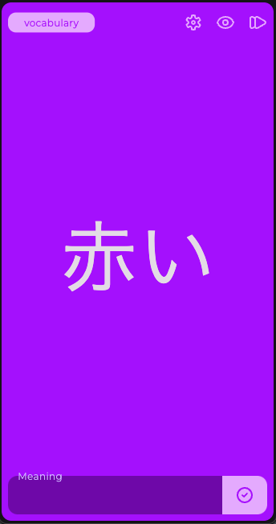
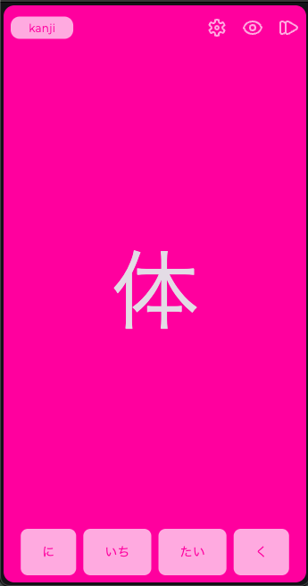

# wanikani

### Motivation
I wanted a simple way of practicing kanjis: pick up my phone and practice for 3 minutes or so.

### What can you practice?
Meanings and readings for all subject types: radicals, kanjis, vocabulary, kana vocabulary. Whatetever you do in this app DOES NOT affect your progress in WaniKani.

### Setup
This app uses the API of the great service WaniKani. You must be subscribed to their service if you want to use this app.

1. [Go to the personal tokens page in WaniKani](https://www.wanikani.com/settings/personal_access_tokens).
2. Create a readonly token: only check `all_data:read`.
3. Copy this token and input it when you first open the app.

